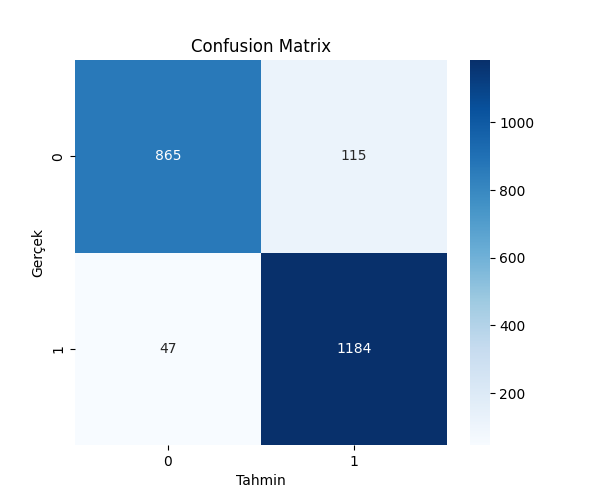
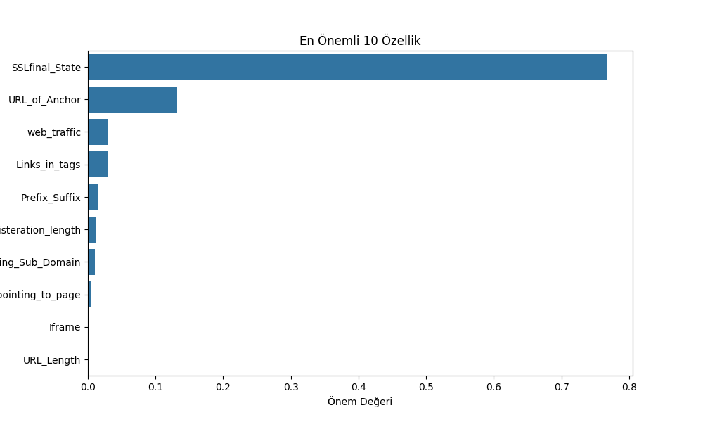
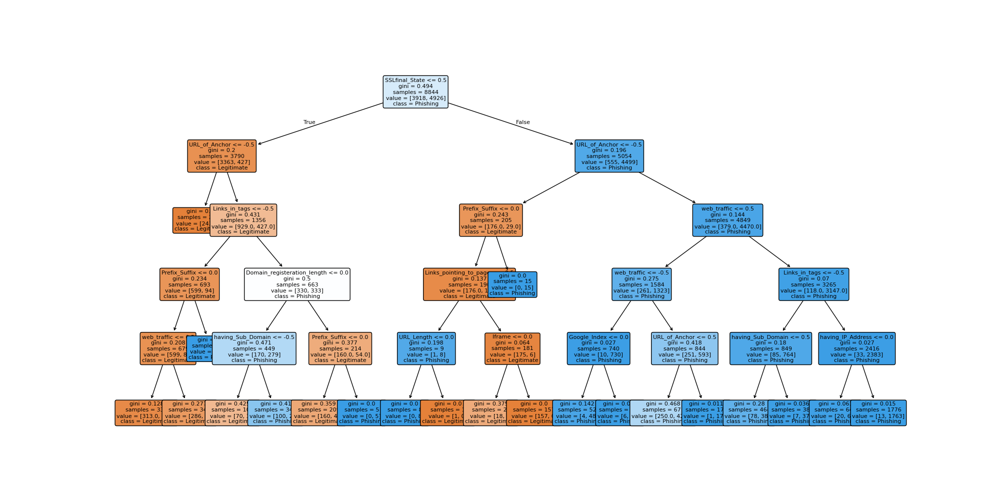

# 🛡️ Phishing Web Sitelerinin Decision Tree Algoritması ile Sınıflandırılması

[](https://www.python.org/)
[](https://scikit-learn.org/)
[]()

## 📌 Proje Hakkında

[](YOUTUBE_VIDEO_LINKINIZI_BURAYA_YAZIN)

Bu proje, **Bursa Teknik Üniversitesi Mühendislik ve Doğa Bilimleri Fakültesi Bilgisayar Mühendisliği Bölümü** kapsamında yürütülen **BLM0463 Veri Madenciliğine Giriş** dersi dönem projesi olarak geliştirilmiştir.

**Projenin Amacı:** Günümüzün en kritik siber güvenlik tehditlerinden biri olan phishing (oltalama) saldırılarını engelleyebilmek adına; kullanıcıları kişisel veri hırsızlığına maruz bırakan sahte web sitelerini makine öğrenmesi yöntemleriyle otomatik olarak tespit etmektir. Projede, web sitelerinin yapısal ve davranışsal özellikleri analiz edilerek **Phishing (Zararlı)** veya **Legitimate (Güvenli)** olarak ikili sınıflandırılması (Binary Classification) hedeflenmiştir.

---

## 📊 Veri Seti Özellikleri

* **Veri Seti:** Phishing Websites Dataset
* **Kaynak:** UCI Machine Learning Repository
* **Toplam Kayıt Sayısı (Örneklem):** 11,055
* **Özellik (Feature) Sayısı:** 30
* **Hedef Değişken (Target):** `Result`
* **Eksik Veri (Missing Value):** Bulunmamaktadır.

### Sınıf Dağılımı
| Sınıf Etiketi | Açıklama | Kayıt Sayısı | Dağılım Oranı |
| :---: | :--- | :---: | :---: |
| **1** | Phishing (Otalama) Web Sitesi | 6,157 | %55.7 |
| **-1** | Legitimate (Güvenli) Web Sitesi | 4,898 | %44.3 |

---

## ⚙️ Veri Ön İşleme (Data Preprocessing)

Model eğitimine geçilmeden önce veri seti üzerinde şu adımlar uygulanmıştır:
1. **Veri Okuma:** `.arff` formatındaki ham veri seti Python ortamına aktarılmıştır.
2. **Tip Dönüşümü:** Byte formatında tutulan ham veriler önce `string` tipine, ardından matematiksel modellemeye uygun olarak `integer` veri tipine dönüştürülmüştür.
3. **Eksik Veri Kontrolü:** Veri setinde eksik gözlem (NaN/Null) olmadığı doğrulanmıştır.
4. **Özellik Ayırımı:** Girdi nitelikleri (X) ile hedef değişken (y) birbirinden ayrılmıştır.
5. **Veri Bölme:** Modelin aşırı öğrenmesini (overfitting) engellemek amacıyla veri seti **%80 Eğitim (8844 kayıt)** ve **%20 Test (2211 kayıt)** kümesi olarak rastgele bölünmüştür.

---

## 🤖 Kullanılan Model ve Parametreler

Sınıflandırma mimarisi olarak yorumlanabilirliği yüksek ve kural tabanlı çalışan **Decision Tree (Karar Ağacı)** algoritması tercih edilmiştir. Model oluşturulurken kullanılan hiperparametreler şunlardır:

* **criterion:** "gini" (Bölünme kalitesini ölçme kriteri)
* **max_depth:** 5 (Ağacın maksimum derinlik sınırı)
* **random_state:** 42 (Tekrarlanabilir sonuçlar için sabit seed)

---

## 📈 Deneysel Sonuçlar ve Performans Metrikleri

Modelin test kümesi (2,211 kayıt) üzerindeki performans analizi, sınıflandırma problemlerinde kabul gören temel metrikler kullanılarak ölçülmüştür:

* **Accuracy (Doğruluk):** %92.67
* **Precision (Keskinlik):** %91.15
* **Recall / Sensitivity (Duyarlılık):** %96.18
* **Specificity (Özgüllük):** %88.27
* **F1-Score (Dengeli Başarı):** %93.60

### Hata Matrisi (Confusion Matrix)

Modelin gerçek sınıflar ile tahmin edilen sınıflar arasındaki uyum tablosu aşağıdadır:

* **Gerçek Güvenli olup Güvenli Tahmin Edilen (TN):** 865
* **Gerçek Güvenli olup Phishing Tahmin Edilen (FP):** 115
* **Gerçek Phishing olup Güvenli Tahmin Edilen (FN):** 47
* **Gerçek Phishing olup Phishing Tahmin Edilen (TP):** 1184

* **Yorum:** Model, test kümesindeki 1,231 phishing sitesinden 1,184 tanesini başarıyla yakalamıştır. Sadece 47 adet zararlı site gözden kaçmıştır (Düşük False Negative). Bu durum siber güvenlik odaklı bir sistem için oldukça kritik bir başarı kriteridir.

---

## 🖼️ Proje Çıktıları ve Grafikler

Programın yürütülmesiyle üretilen ve analiz süreçlerinde kullanılan grafik çıktısı görselleri aşağıda sunulmuştur:

### 1. Hata Matrisi Grafiği
Modelin sınıflandırma doğruluğunu ve hata dağılımlarını görselleştiren Confusion Matrix:


### 2. Özellik Önem Dereceleri (Feature Importance)
Karar ağacının hedef değişkeni ayırt ederken en çok ağırlık verdiği ilk 10 özelliğin dağılımı. Grafikte de görüldüğü üzere sitenin **SSLfinal_State** (SSL Durumu) ve **URL_of_Anchor** nitelikleri phishing tespitinde en baskın rolü oynamaktadır:


### 3. Karar Ağacı Mimarisi (Decision Tree Visualization)
Modelin `max_depth=5` parametresine göre kök düğümden (`SSLfinal_State <= 0.5`) başlayarak oluşturduğu kademeli karar kuralları yapısı:


---

## 📁 Proje Yapısı

```text
phishing-decision-tree
│
├── data/
│   └── Training Dataset.arff       # UCI'dan alınan ham veri seti
│
├── outputs/
│   ├── confusion_matrix.png       # Kaydedilen hata matrisi görseli
│   ├── feature_importance.png     # Önemli özellikler bar grafiği
│   └── decision_tree.png          # Karar ağacı çizim şeması
│
├── src/
│   └── main.py                    # Algoritma, eğitim ve test kodları
│
├── README.md                      # Proje genel dökümantasyonu
└── requirements.txt               # Bağımlı kütüphaneler listesi

💻 Kurulum ve Çalıştırma

Gereksinimler
Proje çalıştırılmadan önce sisteminizde Python 3.x ortamının kurulu olduğundan emin olunuz. Gerekli kütüphaneler: pandas, numpy, scikit-learn, matplotlib, seaborn, scipy.

Depoyu klonlayın veya proje klasörüne gidin:

Bash
cd phishing-decision-tree
Gerekli kütüphaneleri terminal üzerinden yükleyin:

Bash
pip install -r requirements.txt
Projeyi başlatın:

Bash
python src/main.py
🎓 Proje Ekibi ve Yönetim
Hazırlayan: Aynur Adıbelli

Öğrenci Numarası: 22360859008

Kurum: Bursa Teknik Üniversitesi

Bölüm: Bilgisayar Mühendisliği Bölümü

Dönem: Haziran 2026
